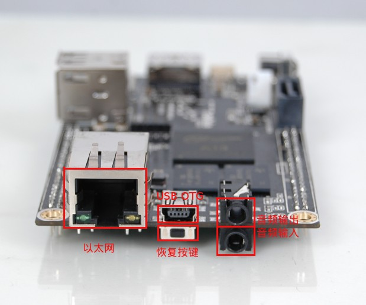

CUBIEBOOK - The missing cubieboard manual
=========================================

## cubieboard的硬件组成和接口情况

cubieboard的尺寸是6厘米x10厘米，你可以很轻松的握在手掌，但是，它却是一个完整功能的计算机。拥有一个计算机所必备的全部功能，甚至还多出一些东西(比如红外接口)。

下面介绍一下cubieboard的各部分组成：

* 处理器 - cubieboard的大脑--CPU使用的是珠海全志科技的A10芯片，A10是个名字，是全志公司自己取的，不代表其他任何意义。就像苹果把它的芯片叫A4，A5一样。A10芯片是基于英国ARM公司的cpu设计的。A10芯片内部不仅仅只包含CPU，还包含了GPU--图形处理器(你可以认为是集成显卡)，还包含了很多其他的控制器，比如处理音频的，处理视频解码的等等。总之，芯片内部集成了很多东西 ，这就是为什么你看到电路板上和PC主板相比，很干净，没什么东西，并且尺寸那么小。

* 内存 - 不同于PC，cubieboard上的内存是不能插拔和替换的(因为体积小)，是直接焊在电路板上面的。cubieboard有两种内存规格512MB和1GB的，用户都倾向于买1GB内存的，所以现在512MB内存的cubieboard很少生产了。

* 电源插座 - cubieboard的电源插座用的是市面上常见的圆孔插座，输入电压是5V，每个cubieboard都配备了一条连接电源插座到USB的转换线，可以轻松用任何手机或平板电脑充电器给cubieboard供电。注意，所接外设(U盘，硬盘等等)不同，所需要的电源配适器的额定电流也不同。

* 电源键 - 电源按键是用来开/关机，休眠/唤醒的。电源键支持长按(大约5秒)和短按，长按是强制系统断电，短按是系统休眠唤醒。注意，如果系统没有插电源，直接插电源即可开机，不需要按电源键。如果，长按电源键或是在系统中关机，这时候还插着电源，长按电源键则可以重新开机。

* HDMI接口 - 高清数字多媒体接口，可以通过HDMI线把cubieboard接到HDMI电视机或者是支持HDMI的显示器或投影仪。Cubieboard的HDMI接口支持HDMI1.3和1.4标准，支持3D显示，支持分辨率自适应(EDID)。

* 以太网 - Cubieboard是用的是100M/10M自适应以太网接口，插入和普通电脑一样的网线配置一下即可上网。

* USB OTG - OTG

* 恢复按键 - 恢复按键又叫FEL按键，是刷机/恢复系统用的。如果你按住这个按键启动系统，会进入刷机模式，进入刷机模式的cubieboard需要另外一台PC的帮助来完成刷机，详见 [如何给cubieboard恢复系统/刷机](../update/update.md)

* 音频输入输出

cubieboard的一个侧面

* 以太网卡
* USB OTG
* FEL
* 模拟音频输入、输出
