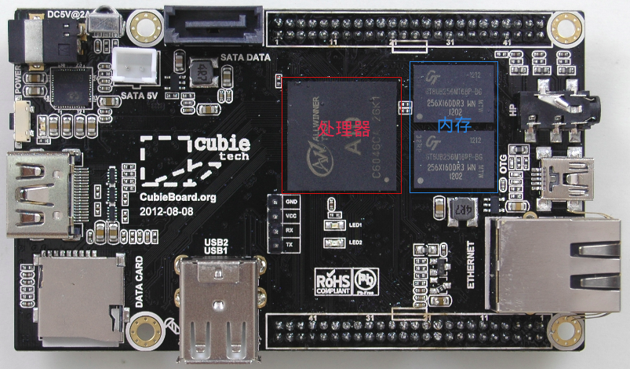
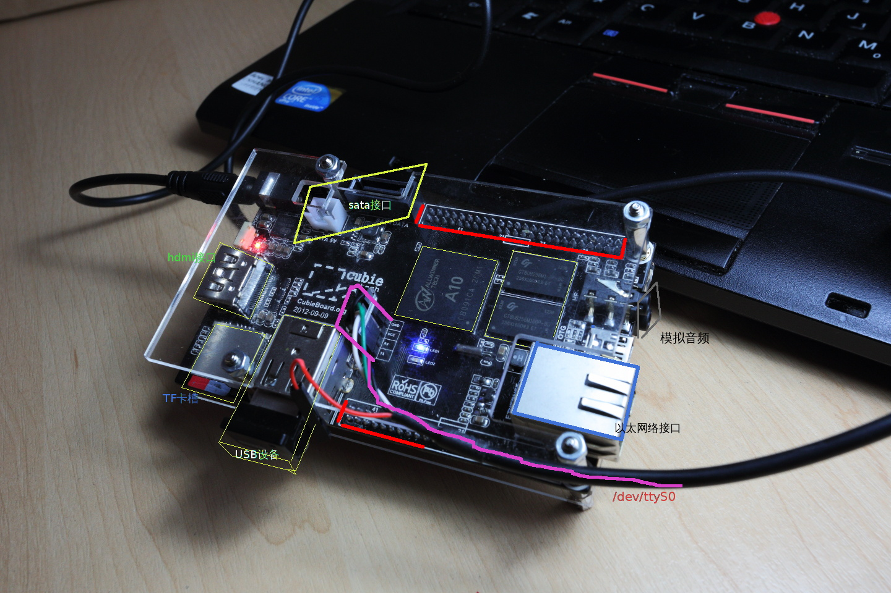
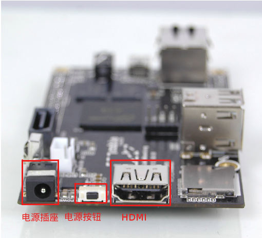
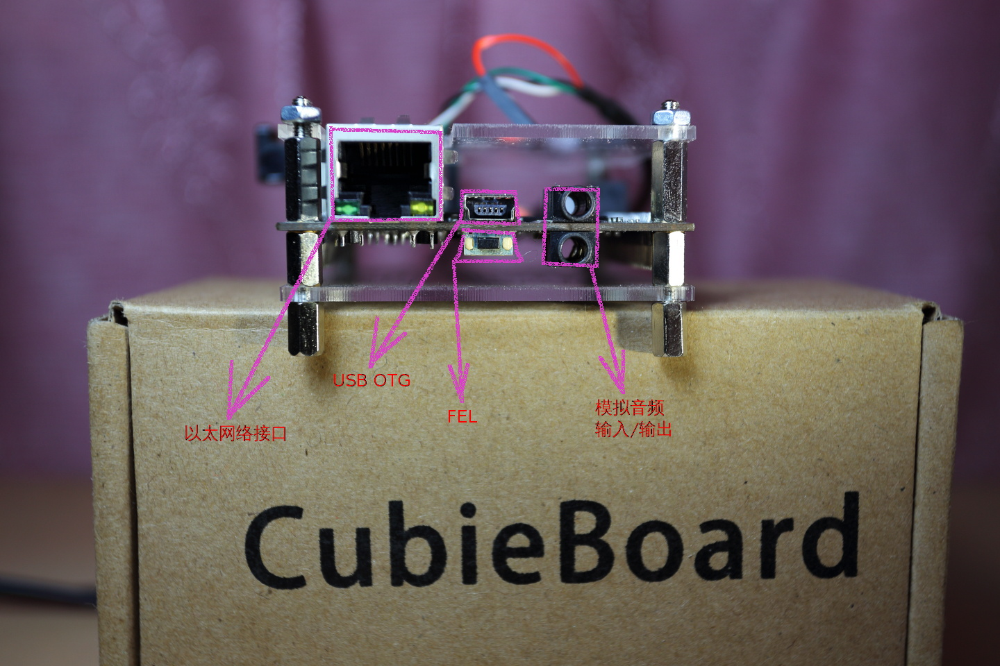

CUBIEBOOK - The missing cubieboard manual
=========================================

## cubieboard的硬件组成和接口情况

* cubieboard的尺寸：6x10厘米，它是一个完整功能的计算机。
* 在性能上，cubieboard可以和上世纪90年代的PC媲美（CPU性能大致相当于中档Intel Pentium III）

下面介绍一下cubieboard上面各个部分。

* 处理器 - cubieboard的大脑-CPU使用的是珠海全志科技的A10芯片，A10是个名字，是全志公司自己取的，不代表其他任何意义。就像苹果把它的芯片叫A4，A5一样。A10芯片是基于英国ARM公司的cpu设计的。A10芯片内部不仅仅只包含CPU，还包含了GPU-图形处理器(你可以认为是集成显卡)，还包含了很多其他的控制器(你可以认为它集成了南桥北桥)。总之，芯片内部集成了很多东西 ，这就是为什么你看到电路板上和PC主板相比，很干净，没什么东西，并且尺寸那么小。

* 内存 - 不同于PC，cubieboard上的内存是不能插拔和替换的(因为体积小)，是直接焊在电路板上面的。cubieboard有两种内存规格512MB和1GB的，用户都倾向于买1GB内存的，所以现在512MB内存的cubieboard很少生产了。

一个正在工作中的cubieboard

* 电源插座 - cubieboard的电源输入电压是5V，建议使用1A的电源适配器
    * 如果不打算使用板载电源对SATA硬盘供电，500mA也可以满足要求
* 电源键
    * 长按进行关闭、重新打开
* HDMI接口
    * 接泊具有HDMI输入的电视机或显示器

cubieboard的一个侧面

* 以太网卡
* USB OTG
* FEL
* 模拟音频输入、输出
